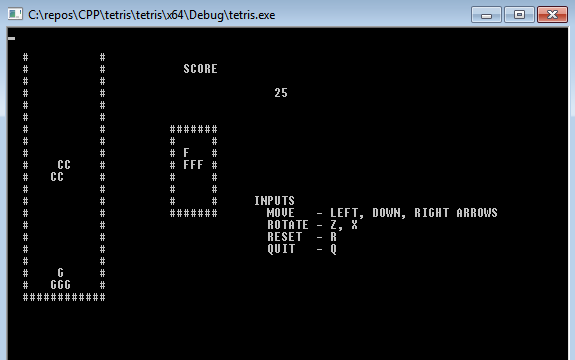

# TETRIS

os: windows, MVS2019
type: consola, C++

Basic game to play. Main goal is to make small ANN play the game.

###User input
Arrows LEFT/RIGHT/DOWN, Z and X rotation, R to reset, Q to quit.

#####Version:
	0.0.1 basic core. 

TODO:
- refactor (add descripts, label, ect... , sort code to work in parallel instances).
- prep for small NN to 'see' and respond with input key.